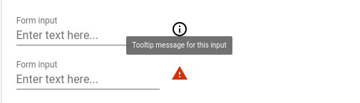
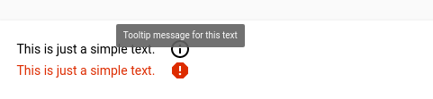

# \<etools-info-tooltip\>

Tooltip element associated with form elements (or any other element), 
an icon is used to trigger tooltip open.






## Usage
```html
<etools-info-tooltip message="Tooltip message for this input">
  <paper-input label="Form input" placeholder="Enter text here..."></paper-input>
</etools-info-tooltip>

<etools-info-tooltip message="Tooltip message for this input" icon="report-problem" important-warning>
  <paper-input label="Form input" placeholder="Enter text here..."></paper-input>
</etools-info-tooltip>

<etools-info-tooltip message="Tooltip message for this text">
  <span>This is just a simple text.</span>
</etools-info-tooltip>

<etools-info-tooltip message="Tooltip message for this text" icon="report" important-warning>
  <span>This is just a simple text.</span>
</etools-info-tooltip>
```

Properties:
* icon - String, default: `info-outline`, only default set of icons can be used
* message - String
* position - String, Default: `top`

You can use `important-warning` attribute and `icon` property to make the field style look like a warning
(using `--error-color` var) on the UI.


## Styling

You can use `paper-tooltip` and element variables and mixins to change tooltip style.

Custom property | Description | Default
----------------|-------------|----------
`--paper-tooltip-background` | Tooltip background | `#ffffff`
`--paper-tooltip-opacity` | Tooltip opacity | `1`
`--paper-tooltip-text-color` | Tooltip text color | `var(--primary-text-color, rgba(0, 0, 0, 0.87)`
`--paper-tooltip` | Tooltip mixin | `{box-shadow: 0 6px 12px rgba(0, 0, 0, 0.175);border: 1px solid rgba(0, 0, 0, 0.15);border-radius: 4px;}`
`--etools-tooltip-trigger-icon` | Mixin applied to the icon that triggers tooltip open | `{}`


## Install
```bash
$ bower install --save etools-info-tooltip
```

## Preview element locally

Install needed dependencies by running: `$ bower install`.
Make sure you have the [Polymer CLI](https://www.npmjs.com/package/polymer-cli) installed. Then run `$ polymer serve` to serve your element application locally.

## Linting the code

Innstall local npm packages (run `npm install`)
Then just run the linting task

```bash
$ npm run lint
```
You should also use polylint. If you don't have Polylint installed run `npm install -g polylint`.
Then just run the linter on each file you wish to check like so

```bash
$ polylint -i filename.html
```
At the moment polylint crashes if it encounters a missing import. If that happens, temporarily comment out such imports and run the command again.

## Running Tests

You need to have `web-component-tester` installed (if not run `npm install -g web-component-tester`)
```bash
$ wct
```
or
```bash
$ wct -p
```
